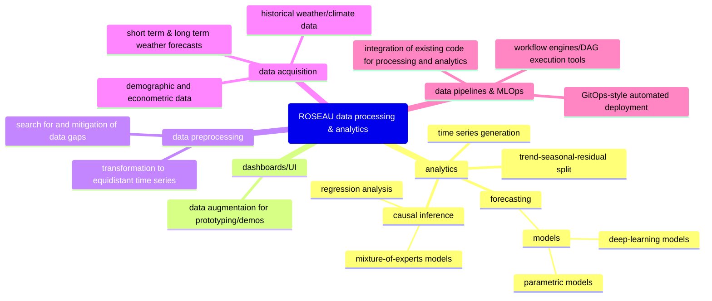

## Conceptual Brainstorming

## data preprocessing
### transformation to equidistant time series
Many models for time series analysis/forecasting work with the assumption that data points in examined series refert to regular, equidistant points in time (e.g. exactly each 10 seconds), which is not a property given in the current data captured by the prototype.
Many data processing libraries/packages offer however helper functions to re-sample time series into equidistant ones by various heuristings (interpolation, min, max, ...).

## analytics
### causal inference
Causal inference methods on fitted models can give insights that can be translated into in-domain hypotheses like 'water source X is especially influenced by intensity of sunlight'.
### trend-seasonal-residual split
Time series can often be decomposed in trend, seasonality and residuals, which can often help to create more clearly interpretable visualisations, especially trend lines.
